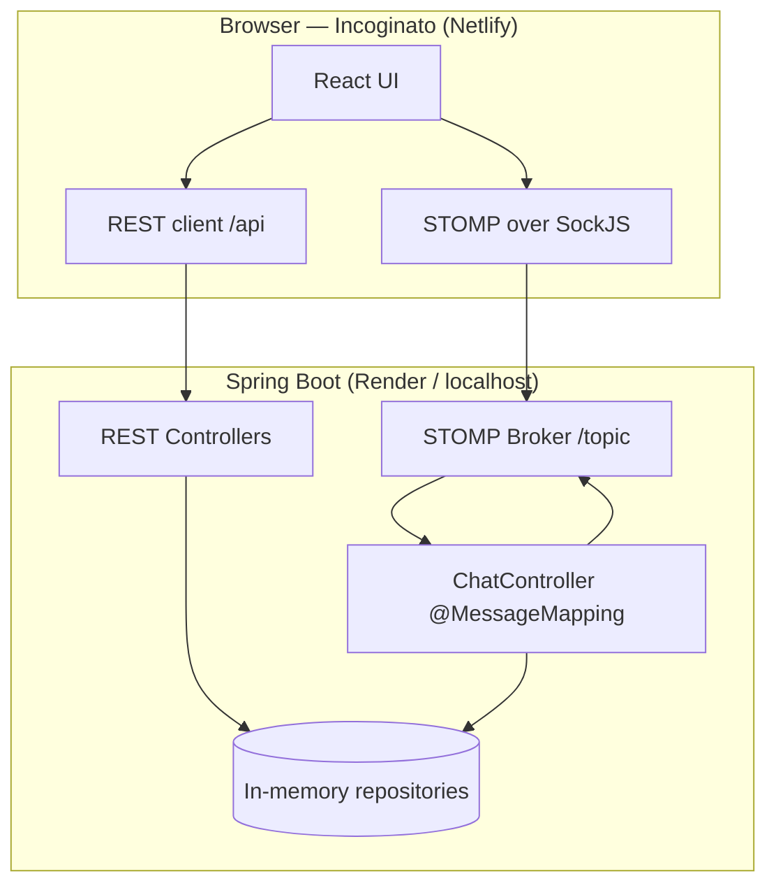
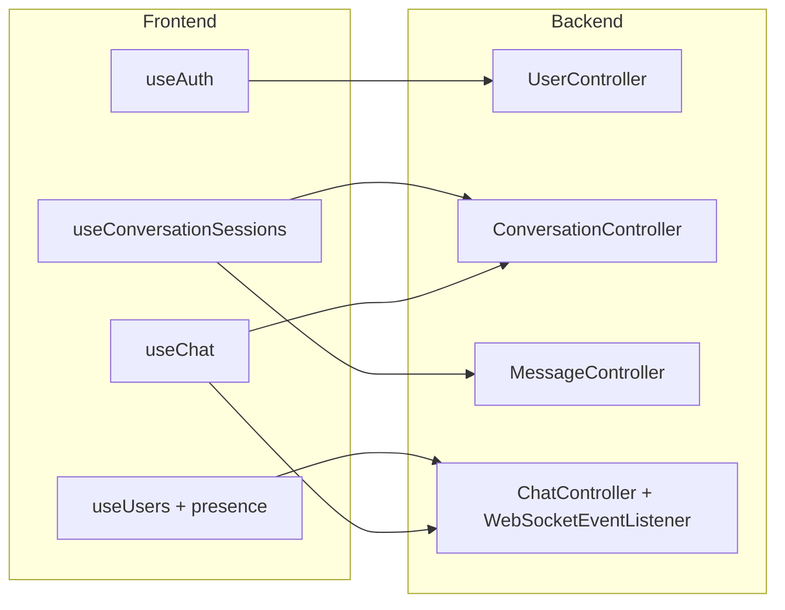
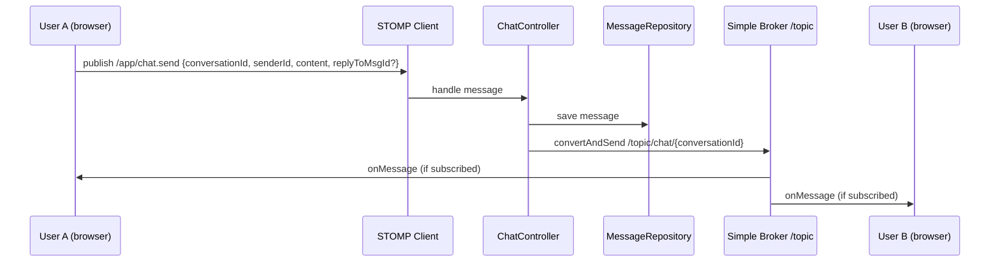
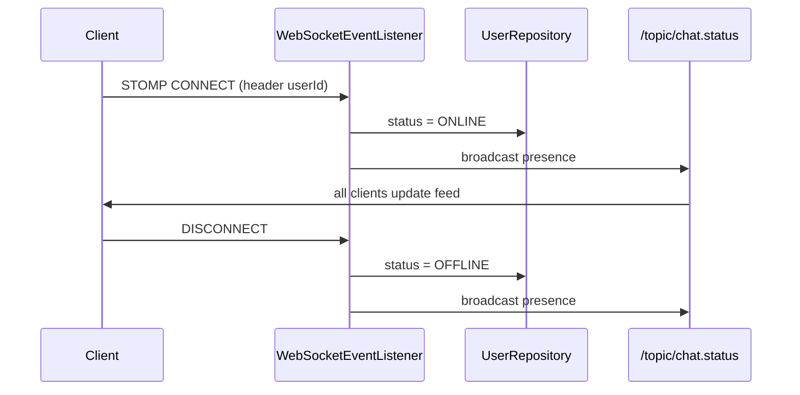

# Incoginato

**Incoginato** is an anonymous real-time chat application. Users join with a nickname and bio, see who is online, start conversations, send messages over WebSocket, reply to specific messages (swipe-to-reply), and manage their profile. The live frontend is hosted at **[incoginato.netlify.app](https://incoginato.netlify.app/)**.

---

## What this project does

| Feature | Description |
|--------|-------------|
| **Join / identity** | Create a lightweight profile (username, bio, avatar color). Session is restored via `localStorage`. |
| **Online feed** | See other users who are `ONLINE` or `TYPING`. |
| **1:1 chat** | Open a conversation, load history, send and receive messages in real time. |
| **Conversation list** | Sidebar lists all past chats with last-message preview and unread hints. |
| **Reply to message** | Swipe a message (mobile) or use reply UI; quotes are stored on the server (`replyToMsgId`). |
| **Presence** | Connect/disconnect updates user status and broadcasts to all clients. |
| **Profile** | View username, user ID, bio; delete account. |

> **Note:** Users, conversations, and messages are stored **in memory** on the server. Data is lost when the backend restarts (fine for demos; use a database for production).

---

## Tech stack

### Frontend (`frontend/`)

| Technology | Role |
|------------|------|
| **React 19** | UI components and state |
| **TypeScript** | Type-safe client code |
| **Vite 8** | Dev server, build, proxy to backend locally |
| **SockJS + STOMP** (`@stomp/stompjs`) | WebSocket client |
| **CSS** | Custom theme (`whisper.css`) |

### Backend (`src/main/java/com/secret/`)

| Technology | Role |
|------------|------|
| **Java 21** | Runtime |
| **Spring Boot 4** | REST API, DI, embedded server |
| **Spring WebSocket + STOMP** | Real-time messaging |
| **Lombok** | Boilerplate reduction on entities/DTOs |
| **In-memory repositories** | `ConcurrentHashMap` / `Queue` storage |

### Deployment (optional)

| Service | Artifact |
|---------|----------|
| **Netlify** | Static React build (`frontend/dist`) |
| **Render** | Docker image from root `Dockerfile` |

---

## Project structure

```text
secret/
├── frontend/                 # React app (Incoginato UI)
│   ├── src/
│   │   ├── components/       # ChatView, Sidebar, Profile, etc.
│   │   ├── hooks/            # useAuth, useChat, useUsers, useConversationSessions
│   │   └── services/         # api.ts, websocket.ts, mappers
│   ├── netlify.toml
│   └── package.json
├── src/main/java/com/secret/
│   ├── controller/           # REST + STOMP handlers (ChatController)
│   ├── configs/              # CORS, WebSocket broker
│   ├── entity/               # Users, Messages, Conversations
│   ├── repository/           # In-memory stores
│   └── dto/                  # Request/response payloads
├── Dockerfile                # Render / local Docker
├── docker-compose.yml
├── render.yaml               # Render Blueprint (optional)
└── pom.xml
```

---

## Architecture overview

High-level view of how the browser talks to the API and WebSocket broker.



### REST API (main endpoints)

| Method | Path | Purpose |
|--------|------|---------|
| `GET/POST` | `/users` | List / create users |
| `GET/DELETE` | `/users/{id}` | Get / delete user |
| `POST` | `/conversations` | Create or return existing 1:1 conversation |
| `GET` | `/conversations/user/{userId}` | List conversations + last message summary |
| `GET` | `/messages/{conversationId}` | Message history (queue as JSON array) |
| `GET` | `/health` | Health check (deploy / uptime ping) |

### Component responsibilities



---

## WebSocket — how it works

The app does **not** use raw WebSockets alone. It uses **STOMP** (a messaging protocol) on top of **SockJS** (fallback-friendly transport).

### Connection

1. User logs in → frontend calls `ws.connect(userId)`.
2. Client opens **SockJS** to `{API_URL}/ws`.
3. **STOMP** connects with header `userId` so the server can mark the user **ONLINE** and broadcast presence.

### Destinations

| Direction | Destination | Purpose |
|-----------|-------------|---------|
| Client → Server | `/app/chat.send` | Send a chat message |
| Client → Server | `/app/chat.typing` | Typing indicator |
| Server → Client | `/topic/chat/{conversationId}` | New messages in a thread |
| Server → Client | `/topic/chat/{conversationId}/typing` | Typing events |
| Server → Client | `/topic/chat.status` | User online/offline updates |

### Sending a message (sequence)



### Subscribing to a chat

When User A opens a chat with User B:

1. `POST /conversations` → get `conversationId`.
2. Subscribe to `/topic/chat/{conversationId}` and `.../typing`.
3. `GET /messages/{conversationId}` → load history.
4. New messages arrive on the topic without polling.

### Presence flow



---

## Clone and run locally

### Prerequisites

- **Java 21** and **Maven**
- **Node.js 20+** and **npm**

### 1. Clone the repository

```bash
git clone https://github.com/DakhinTudu/whisper.git
cd whisper
```

> The GitHub repo may still be named `whisper`; the product name is **Incoginato**.

### 2. Start the backend

```bash
# From project root
mvn spring-boot:run
```

API runs at **http://localhost:8080**  
Health check: **http://localhost:8080/health**

### 3. Start the frontend

```bash
cd frontend
npm install
npm run dev
```

Open **http://localhost:5173** — Vite proxies `/users`, `/conversations`, `/messages`, and `/ws` to port `8080`.

Optional: set API URL explicitly (e.g. for a remote backend):

```bash
# frontend/.env.local
VITE_API_URL=http://localhost:8080
```

### 4. Run with Docker (backend only)

```bash
docker compose up --build
```

Then point the frontend at `http://localhost:8080` as above.

---

## Production deployment (summary)

| Layer | Host | Config |
|-------|------|--------|
| Frontend | **Netlify** | Base dir: `frontend`, build: `npm ci && npm run build`, env: `VITE_API_URL=https://your-api.onrender.com` |
| Backend | **Render** | Docker, `Dockerfile`, health path `/health`, env: `APP_CORS_ALLOWED_ORIGIN_PATTERNS` includes your Netlify URL |

Detailed deploy steps live in local docs (ignored from git); mirror the same flow: deploy API first, then set `VITE_API_URL` on Netlify and rebuild.

**Render free tier:** the service may sleep after ~15 minutes idle; use a paid plan or an external ping on `/health` every 5 minutes if you need fewer cold starts.

---

## Environment variables

### Backend

| Variable | Default | Description |
|----------|---------|-------------|
| `PORT` | `8080` | HTTP port (set by Render) |
| `APP_CORS_ALLOWED_ORIGIN_PATTERNS` | localhost + `https://*.netlify.app` | CORS for REST |

### Frontend (build time)

| Variable | Example | Description |
|----------|---------|-------------|
| `VITE_API_URL` | `https://secret-api.onrender.com` | Backend base URL (no trailing slash) |

---

## License

This project is provided as-is for learning and demonstration.
---

## Links

- **Live app:** [https://incoginato.netlify.app](https://incoginato.netlify.app/)
- **Repository:** [https://github.com/DakhinTudu/whisper](https://github.com/DakhinTudu/whisper)
