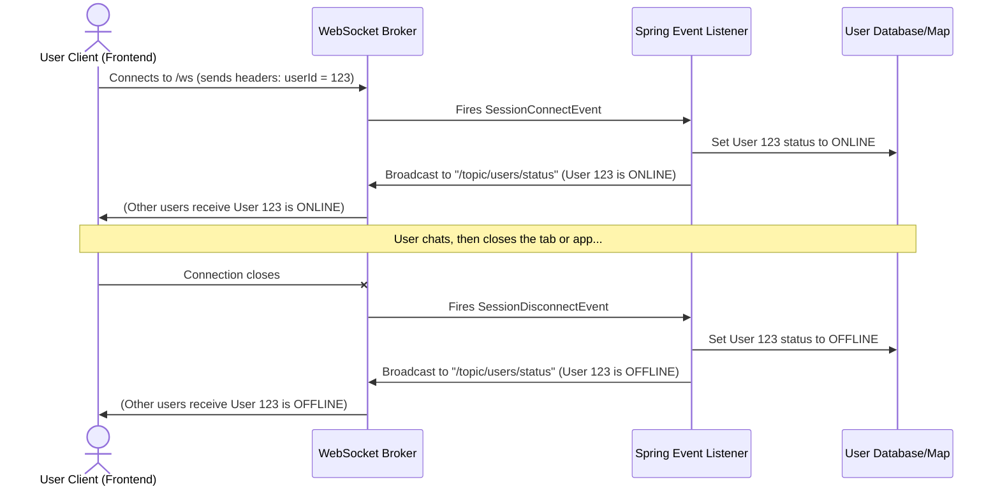
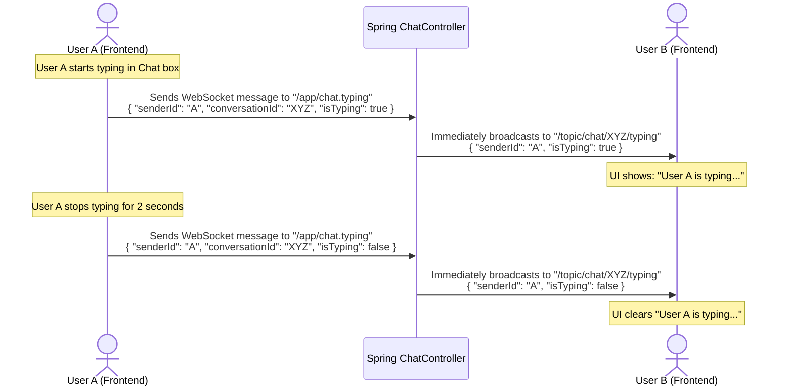

# Conceptual Flow: Presence Tracking & Typing Indicators

To build these features, we need to understand exactly how data travels between the client (frontend) and server (backend) at every stage.

---

## 1. Presence Tracking (Online / Offline Status)

Presence tracking lets users see who is currently active. The challenge is: **how does the server know who connects and when they disconnect?**

### The Flow Diagram

### Step-by-Step Breakdown

#### Step 1: The Connection and Identification
When the client establishes a WebSocket connection, they connect to `/ws`. But the server needs to know *who* this client is.
*   During the connection handshake, the client sends custom metadata in the **STOMP headers** (like a `userId` or authentication token).
*   Spring Boot receives this and binds it to the connection session.

#### Step 2: The Connect Event
*   Once the connection is established, Spring Boot raises a `SessionConnectEvent`.
*   A custom listener in your backend catches this event. It reads the `userId` from the connection headers.
*   The listener calls your database (e.g. `UserRepository`) and updates that user's status to `ONLINE`.

#### Step 3: Alerting Other Users
*   Just changing the database isn't enough; other users need to know.
*   The backend sends a broadcast message to a shared topic, such as `/topic/users/status`.
*   The message contains: `{"userId": "123", "status": "ONLINE"}`.
*   Everyone subscribed to this topic will receive this update instantly and see the status dot turn green.

#### Step 4: The Disconnect Event
*   When a user closes their browser, loses signal, or navigates away, the socket closes.
*   Spring Boot detects this loss of connection and raises a `SessionDisconnectEvent`.
*   The custom listener catches this event, retrieves the `userId` associated with that session, updates their status in the database to `OFFLINE`, and broadcasts `{"userId": "123", "status": "OFFLINE"}` to `/topic/users/status`.

---

## 2. Typing Indicators (Real-Time "Typing..." Text)

Typing indicators tell a user that someone is active in their specific chat window. Unlike messages or presence status, typing indicators are **highly temporary** and **do not need to be saved in any database**.

### The Flow Diagram

### Step-by-Step Breakdown

#### Step 1: The Trigger
*   In the frontend chat window, when User A starts typing in the message box, the frontend triggers a JavaScript listener (such as `onKeyDown` or `onChange`).
*   To avoid overloading the network, the frontend uses a debounce timer (sending the typing signal once every few seconds, rather than on every single keystroke).

#### Step 2: Sending the Event
*   The frontend sends a small JSON message to the server's outgoing message destination: `/app/chat.typing`.
*   The payload contains:
    *   `conversationId`: The specific chat room.
    *   `senderId`: Who is typing.
    *   `isTyping`: `true`.

#### Step 3: Forwarding the Message
*   The backend's `@MessageMapping("/chat.typing")` catches this payload.
*   Since this is temporary, the backend does **not** write anything to `MessageRepository`. 
*   It immediately calls `simpMessagingTemplate.convertAndSend` to broadcast the payload to the conversation topic: `/topic/chat/{conversationId}/typing`.

#### Step 4: The Stop Trigger
*   When User A stops typing (the input box is empty, or they stop typing for 2-3 seconds), the frontend sends another event to `/app/chat.typing` with `isTyping: false`.
*   The backend forwards it, and User B's UI clears the typing message.
